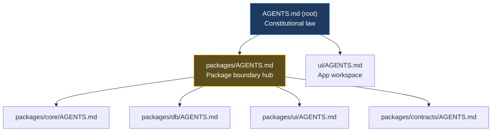

# AGENTS.md Specification

This document defines the formal pattern for writing `AGENTS.md` files in the Enterprise Platform. Any new workspace MUST follow this specification to ensure AI agents receive consistent, actionable context.

## Purpose

`AGENTS.md` files are the **constitutional documents** of each workspace. They tell AI coding assistants:
- What this workspace does
- What rules are non-negotiable
- Where to put new code
- What correct code looks like
- How to verify their work

---

## Hierarchy



**Resolution rules:**
- Root `AGENTS.md` defines rules that ALL workspaces follow
- Workspace `AGENTS.md` files **specialize** but NEVER contradict the root
- If a conflict exists, the root wins
- The nearest `AGENTS.md` in the file path applies (directory proximity)

---

## Required Sections (in order)

Every workspace `AGENTS.md` MUST include these sections in this exact order:

| # | Section | Purpose | Format |
|---|---------|---------|--------|
| 1 | **Title + Purpose** | What this workspace is | 1-2 sentences |
| 2 | **Auto-invoke Skills** | When to load which skill | Table: Action → Skill |
| 3 | **Critical Rules** | Non-negotiable constraints | ALWAYS/NEVER or ✅/❌ format |
| 4 | **Decision Trees** | Where to put code | ASCII tree with branches |
| 5 | **Patterns** | What correct code looks like | Code blocks (2-4 examples) |
| 6 | **Rules** | Governance and conventions | Numbered list |
| 7 | **Project Structure** | File/folder map | Annotated ASCII tree |
| 8 | **Commands** | How to operate this workspace | Code block with scripts |
| 9 | **QA Checklist** | Pre-commit verification | Checkbox list |

---

## Section Specifications

### 1. Title + Purpose

```markdown
# @enterprise/{name} — Agent Instructions

## Purpose

{One to two sentences explaining what this workspace does and its role in the monorepo.}
```

### 2. Auto-invoke Skills

```markdown
### Auto-invoke Skills

When performing these actions, ALWAYS invoke the corresponding skill FIRST:

| Action | Skill |
|--------|-------|
| {Specific action description} | `{skill-name}` |
```

- Actions should be specific and trigger-oriented
- Sort alphabetically
- Only include skills relevant to THIS workspace

### 3. Critical Rules — Non-Negotiable

```markdown
## Critical Rules — Non-Negotiable

### {Category}

- ALWAYS: {what to do} — `{code example if short}`
- NEVER: {what not to do} — {why}
```

**Format options:**
- `ALWAYS` / `NEVER` — for behavioral rules
- `✅` / `❌` — for scope rules (what belongs/doesn't belong here)

**Rules for this section:**
- Binary only — no "sometimes" or "prefer"
- Include inline code when the rule is about syntax
- Keep to 3-5 categories max (React, Types, Styling, etc.)
- This section is the **fallback** when skills don't load — include the most critical patterns

### 4. Decision Trees

```markdown
## Decision Trees

### {Decision Name}

\`\`\`
{Question}?
├── {Condition A} → {Action A}
├── {Condition B} → {Action B}
└── {Condition C}
    └── {Sub-condition} → {Action C}
\`\`\`
```

**Rules:**
- Answer the question "where does this go?" algorithmically
- Use ASCII tree characters: `├──`, `└──`, `│`
- Each leaf ends with a concrete location (file path or package)
- Maximum 2 levels of nesting

### 5. Patterns

```markdown
## Patterns

### {Pattern Name}

\`\`\`typescript
// Code example — minimal, correct, uses real project imports
\`\`\`
```

**Rules:**
- Include 2-4 patterns (the most common operations in this workspace)
- Use real imports from the project (`@enterprise/contracts`, etc.)
- Keep examples minimal — show the pattern, not a full implementation
- These are **fallback patterns** when the relevant skill doesn't load

### 6. Rules

```markdown
## Rules

1. **{Rule name}**: {Description with enough context to be unambiguous}
2. ...
```

**Rules:**
- Numbered, not bulleted
- Bold the rule name
- Keep to 5-8 rules max
- These are governance rules, not code patterns (those go in section 3 and 5)

### 7. Project Structure

```markdown
## Project Structure

\`\`\`
packages/{name}/
├── package.json
├── tsconfig.json
├── AGENTS.md
└── src/
    ├── index.ts          # {annotation}
    ├── {dir}/
    │   ├── {file}.ts     # {annotation}
    │   └── ...
    └── ...
\`\`\`
```

**Rules:**
- Show 2 levels deep minimum
- Annotate key files with `# {purpose}` comments
- Mark generated files with `# ⚠️ GENERATED — do not edit`
- Include enough structure that an agent knows where to create new files

### 8. Commands

```markdown
## Commands

\`\`\`bash
pnpm --filter @enterprise/{name} typecheck    # TypeScript compilation
pnpm --filter @enterprise/{name} test         # Unit tests
pnpm --filter @enterprise/{name} lint         # Biome lint
\`\`\`
```

**Rules:**
- Show the exact commands an agent would run
- Include `--filter` syntax for monorepo packages
- Annotate each command with `# purpose`

### 9. QA Checklist

```markdown
## QA Checklist (before commit)

- [ ] {Workspace-specific check}
- [ ] {Another check}
```

**Rules:**
- Only include checks SPECIFIC to this workspace
- Do NOT repeat checks from the root `AGENTS.md` QA Checklist
- Keep to 5-8 items
- Each item should be verifiable (not vague)

---

## Root AGENTS.md — Additional Sections

The root `AGENTS.md` has extra sections not in workspace files:

| Section | Purpose |
|---------|---------|
| **How to Use This Guide** | Explains the hierarchy (root vs workspace) |
| **Tech Stack** | Full technology table |
| **Monorepo Structure** | Workspace map with aliases |
| **Workspace AGENTS.md** | Table linking all workspace docs |
| **Dependency Direction** | ASCII graph of allowed imports |
| **Architecture Principles** | Numbered doctrine (7 principles) |
| **Service Layer Pattern** | The #1 enforced architectural pattern |
| **Available Skills** | Catalog split into Generic / Platform-Specific |
| **Language Policy** | English-only enforcement |
| **Code Conventions** | Naming, exports, imports |
| **Testing Policy** | What must be tested and how |
| **QA Checklist** | Cross-workspace checks (15 items) |
| **Commit Conventions** | Conventional commits format |

---

## Anti-Patterns

| ❌ Don't | ✅ Do Instead |
|----------|--------------|
| Write rules as prose paragraphs | Use ALWAYS/NEVER or ✅/❌ binary format |
| Describe placement in sentences | Use decision trees with ASCII branches |
| Reference skills without inline fallback | Include 2-4 critical patterns inline |
| Repeat root rules in workspace files | Only add workspace-SPECIFIC rules |
| Write vague QA items ("code is clean") | Write verifiable items ("No `var()` in className") |
| Show full implementations as patterns | Show minimal pattern — just enough to understand |
| List 20+ rules in one section | Keep to 5-8 per section; split into categories |
| Use `cd` commands for monorepo ops | Use `pnpm --filter @enterprise/{name}` |

---

## When to Create a New AGENTS.md

Create a new workspace `AGENTS.md` when:

1. You add a new package to `packages/`
2. The package has its own conventions distinct from existing workspaces
3. An AI agent working in that directory needs context not available in the root

**Steps:**
1. Create `packages/{name}/AGENTS.md` following this spec
2. Add the workspace to the root `AGENTS.md` → "Workspace AGENTS.md" table
3. Add the scope to `skills/skill-sync/assets/sync.sh:get_agents_path()` for auto-invoke sync
4. Run `pnpm skills:sync` to populate the auto-invoke table

---

*Last updated: 2026-05-06*
