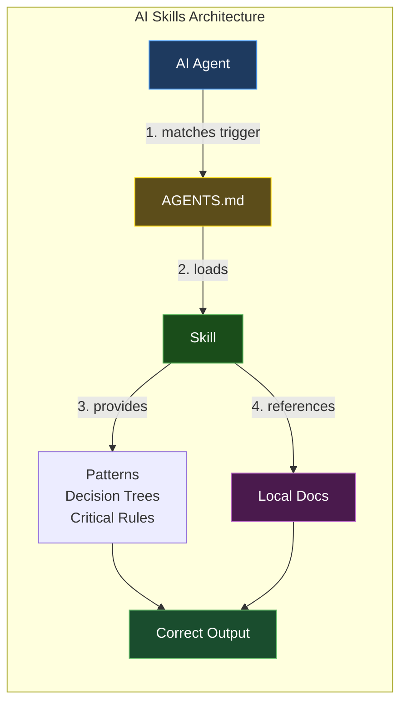
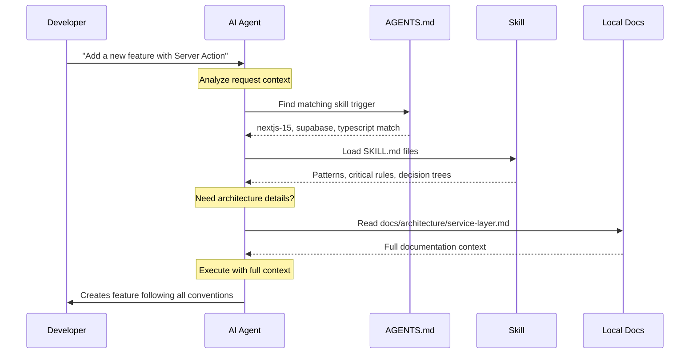
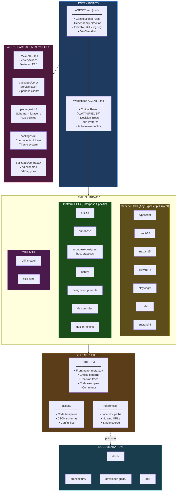

# AI Skills System

This guide explains the AI Skills system that provides on-demand context and patterns to AI agents working with the Enterprise Platform codebase.

> **What are AI Skills?** Skills are structured Markdown instructions (`SKILL.md`) that teach AI agents (OpenCode, Claude Code, Cursor, Copilot, etc.) the project's architecture, conventions, and patterns — so they generate correct code on the first try.

---

## Architecture Overview



---

## How It Works



---

## Complete Architecture



---

## Key Design Decisions

1. **Constitutional hierarchy** — Root `AGENTS.md` is the supreme law; workspace files specialize but never contradict
2. **Self-contained skills** — Critical patterns inline (ALWAYS/NEVER rules) so agents work even if skill loading fails
3. **Decision trees over prose** — Algorithmic placement rules that agents execute as-is
4. **Local doc references** — Skills point to `docs/` files, no web URLs, single source of truth
5. **On-demand loading** — AI loads only skills that match the current task context

---

## Skills Included

| Type | Skills |
|------|--------|
| **Generic** | typescript, react-19, nextjs-15, tailwind-4, playwright, zod-4, zustand-5 |
| **Platform** | drizzle, supabase, supabase-postgres-best-practices, sentry, design-components, design-rules, design-tokens |
| **Meta** | skill-creator, skill-sync |

## Skill Structure

Each skill follows the [Agent Skills spec](https://agentskills.io):

```
skills/{skill-name}/
├── SKILL.md          # Patterns, rules, decision trees
├── assets/           # Code templates, schemas (optional)
└── references/       # Links to local docs (optional)
```

---

## Setup

After cloning the repository, run the setup script to wire skills into your AI assistant:

### Quick Setup (OpenCode only)

```bash
pnpm skills:setup
```

This creates a `.agents/skills/` symlink pointing to `skills/`, which is all OpenCode needs.

### Setup for All Runtimes

```bash
pnpm skills:setup:all
```

Or run the script directly with specific flags:

```bash
bash ./skills/setup.sh --claude     # Claude Code only
bash ./skills/setup.sh --opencode   # OpenCode only
bash ./skills/setup.sh --gemini     # Gemini CLI only
bash ./skills/setup.sh --codex      # Codex (OpenAI) only
bash ./skills/setup.sh --copilot    # GitHub Copilot only
bash ./skills/setup.sh --all        # All of the above
```

### Interactive Mode

Running the script with no flags opens an interactive menu:

```bash
bash ./skills/setup.sh
```

### What Each Runtime Gets

| Runtime | Setup Action |
|---------|-------------|
| **OpenCode** | `.agents/skills/` symlink |
| **Claude Code** | `.claude/skills/` symlink + `CLAUDE.md` copies next to each `AGENTS.md` |
| **Gemini CLI** | `.gemini/skills/` symlink + `GEMINI.md` copies next to each `AGENTS.md` |
| **Codex (OpenAI)** | `.codex/skills/` symlink (uses `AGENTS.md` natively) |
| **GitHub Copilot** | `AGENTS.md` copied to `.github/copilot-instructions.md` |
| **Cursor** | No setup needed — reads `AGENTS.md` natively |

> **Restart your AI assistant** after running setup to load the skills.

---

## Skill Sync

When you add a new skill or update a skill's `metadata.auto_invoke` field, the Auto-invoke tables in `AGENTS.md` files become stale. Run sync to regenerate them:

### Sync All AGENTS.md Files

```bash
pnpm skills:sync
```

### Dry Run (preview changes without writing)

```bash
pnpm skills:sync:dry-run
```

### Sync a Specific Scope

```bash
bash ./skills/skill-sync/assets/sync.sh --scope root
bash ./skills/skill-sync/assets/sync.sh --scope ui
bash ./skills/skill-sync/assets/sync.sh --scope packages/core
bash ./skills/skill-sync/assets/sync.sh --scope packages/db
bash ./skills/skill-sync/assets/sync.sh --scope packages/ui
bash ./skills/skill-sync/assets/sync.sh --scope packages/contracts
```

### When to Run Sync

- After adding a new skill to `skills/`
- After changing `metadata.auto_invoke` in any `SKILL.md`
- After modifying `metadata.scope` in any `SKILL.md`
- After creating a new `AGENTS.md` in a workspace

---

## MCP Configuration

This repository includes a root `.mcp.json` file for **Claude Code** project-level MCP servers.

```json
{
  "mcpServers": {
    "supabase": {
      "type": "http",
      "url": "https://mcp.supabase.com/mcp?project_ref=..."
    }
  }
}
```

### What `.mcp.json` Is For

- **Claude Code** reads `.mcp.json` from the repository root as the project MCP definition.
- This file is the right place for project-scoped integrations such as Supabase, Sentry, and Linear.
- Team members who open the repo in Claude Code get the same MCP wiring automatically.

### OpenCode Uses a Different Location

OpenCode does **not** use `.mcp.json`.

Use these files instead:

| Tool | Location | Purpose |
|------|----------|---------|
| **Claude Code** | `.mcp.json` | Project-level MCP servers |
| **OpenCode** | `opencode.json` | Project-level MCP servers, agents, and runtime config |
| **OpenCode (global)** | `~/.config/opencode/opencode.jsonc` or `~/.config/opencode/opencode.json` | Global MCPs and runtime defaults |

### Current Project MCPs

The committed `.mcp.json` config is intended for Claude Code and includes:

- **Supabase** — project database/auth MCP
- **Sentry** — error tracking MCP
- **Linear** — project management MCP

If you also use OpenCode, keep the equivalent project MCP definitions in `opencode.json` so both tools stay aligned.

---

## Quick Reference

| Goal | Command |
|------|---------|
| Wire skills for OpenCode | `pnpm skills:setup` |
| Wire skills for all runtimes | `pnpm skills:setup:all` |
| Regenerate Auto-invoke tables | `pnpm skills:sync` |
| Preview sync changes | `pnpm skills:sync:dry-run` |
| Sync one workspace only | `bash ./skills/skill-sync/assets/sync.sh --scope ui` |

---

## Troubleshooting

| Problem | Fix |
|---------|-----|
| Skills not loading in assistant | Run `pnpm skills:setup` and restart the assistant |
| Auto-invoke table is empty | Run `pnpm skills:sync` — skills need `metadata.auto_invoke` entries |
| Symlink broken after branch switch | Re-run `pnpm skills:setup` |
| Skill changes not reflected | Restart the AI assistant — most cache skills at session start |
| `CLAUDE.md` not found | Run `pnpm skills:setup:all` (or `--claude`) to create the copies |

---

*Last updated: 2026-05-06*
