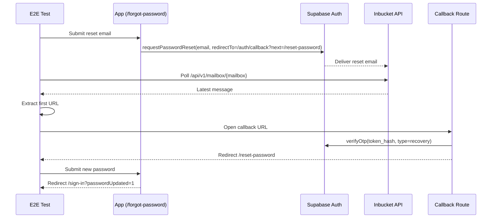

# Testing Strategy

## Purpose

This document defines how the Enterprise Platform template verifies implemented behavior — auth flows, contracts, services, middleware, server actions, queries, and browser-level E2E paths.

## Scope

- **Included**: Coverage matrix, mocking strategy, local pipeline, Inbucket password reset flow, E2E anti-patterns, troubleshooting
- **Excluded**: Performance/load testing, visual regression testing, new product feature test design

---

## Goals

- Keep `/sign-in` as the canonical auth entry route while preserving `/login` compatibility redirect.
- Validate contracts, services, middleware, server actions, server queries, callback route, and real browser auth flows.
- Keep local and CI runs deterministic with seeded users and Inbucket-based password reset.

---

## Coverage Matrix

| Layer | File(s) | Covered scenarios |
|-------|---------|-------------------|
| Contracts DTO | `packages/contracts/src/dto/platform.test.ts` | Auth DTO validation, tenant/user DTO constraints, audit DTO enum + defaults, password confirmation refine path |
| Contracts schemas | `packages/contracts/src/schemas/platform.test.ts` | UUID/entity/auth session schemas, metadata schemas, tenant/audit/action schemas, common field validators |
| Core services | `packages/core/src/services/__tests__/auth-service.test.ts` | Sign-in/out/up/reset/update branches and exact error codes |
| Core env | `packages/core/src/utils/env.test.ts` | Env validation, caching, helpers, predicates, canonical app URL priority + production safety |
| Web redirects | `ui/features/auth/redirects.test.ts` | Safe internal redirect normalization and malformed-input hardening |
| Web middleware | `ui/middleware.test.ts` | Public/protected route behavior, role-home redirects, guest fallback |
| Web actions | `ui/features/auth/actions.test.ts` | All auth actions, validation redirects, success redirects, sign-out integration |
| Web queries | `ui/features/auth/queries.test.ts` | Current user mapping and `requireAuth` redirect |
| Callback route | `ui/app/auth/callback/route.test.ts` | Invalid callback params, OTP error, recovery and non-recovery redirects |
| E2E auth | `ui/e2e/auth/auth.spec.ts` | Sign-in success/failure, deep-link redirect, sign-out, sign-up success/validation failure, forgot-password sent state, protected route redirect, dashboard/settings checks |
| E2E password reset | `ui/e2e/auth/password-reset.spec.ts` | Inbucket polling, reset-link navigation, password update, post-reset login |

---

## Mocking Strategy

### Supabase Mocks

Use chainable `.from().select().eq().single()` mocks to mirror real query flow. Reuse shared helpers from `ui/test-utils/supabase-mocks.ts` where possible — do not write one-off inline mocks per test.

```typescript
// Example: mock a successful single-row fetch
const mockClient = {
  from: vi.fn().mockReturnThis(),
  select: vi.fn().mockReturnThis(),
  eq: vi.fn().mockReturnThis(),
  single: vi.fn().mockResolvedValue({ data: mockUser, error: null }),
};
```

### `next/navigation` Redirect

Unit tests mock `redirect()` to throw a sentinel error defined in `ui/test-utils/redirect.ts`. Tests assert the redirect destination by checking the sentinel digest — not by testing redirect side effects.

```typescript
// In test setup
vi.mock("next/navigation", () => ({
  redirect: (url: string) => { throw new RedirectSentinel(url); },
}));

// In test assertion
await expect(myAction()).rejects.toThrow(RedirectSentinel);
```

### `server-only`

Query tests virtual-mock `server-only` to run in Vitest. This preserves the production module boundary while still allowing the module to be imported in a test environment.

```typescript
vi.mock("server-only", () => ({}));
```

---

## Inbucket Password Reset Flow

The full E2E password reset flow uses Inbucket — the local email capture server bundled with Supabase's local stack.



---

## Local Execution Pipeline

**Full local test pipeline**

```bash
# 1. Start local Supabase
supabase start

# 2. Reset deterministic data
supabase db reset

# 3. Type checks and lint
pnpm typecheck
pnpm lint

# 4. Unit tests
pnpm test

# 5. E2E browser tests
pnpm e2e
```

> **⚠️ E2E requires running local Supabase:** E2E tests connect to a real local Supabase instance. Always run `supabase start` and `supabase db reset` before running `pnpm e2e`. If tests fail with auth errors, re-run `supabase db reset` to restore seeded users.

---

## E2E Anti-Patterns

### Do Not Test Skeleton/Loading States

Skeleton components are transient — they appear briefly during SSR streaming and disappear when real content loads. Testing skeleton visibility is inherently flaky because:

- In fast environments (CI with warm cache), skeletons may never render visibly.
- In slow environments, they may persist longer than expected.
- Race conditions between assertion and render completion are common.

**Instead**: Test the end state after navigation completes. Assert on the real content, not the loading placeholder.

```diff
- // BAD: testing transient state
- await expect(page.locator('.skeleton')).toBeVisible();
- await expect(page.locator('.skeleton')).not.toBeVisible();
+ // GOOD: test the end state directly
+ await expect(page.getByRole('heading', { name: 'Settings' })).toBeVisible();
```

---

## Troubleshooting

| Problem | Fix |
|---------|-----|
| **Cannot sign in with seeded users** | Run `supabase db reset` to re-apply `supabase/seed.sql`. Confirm users exist in Auth and `profiles` rows have expected roles. |
| **Password reset E2E times out waiting for email** | Verify Inbucket is running on `http://localhost:55334`. Optionally set `INBUCKET_URL` when using a non-default endpoint. Ensure the mailbox is not rate-limited — tests rotate between `reset@enterprise.dev` and `reset2@enterprise.dev` on retries. |
| **Unexpected redirect behavior in unit tests** | Ensure tests use the redirect sentinel helper (`ui/test-utils/redirect.ts`) rather than ad-hoc redirect mocks. |
| **Middleware test import fails due to env vars** | `NEXT_PUBLIC_SUPABASE_URL` and `NEXT_PUBLIC_SUPABASE_ANON_KEY` must be set before importing `ui/middleware.ts` in tests. Add them to the Vitest setup file or test environment. |
| **E2E test fails with "No such element"** | The page may not have finished loading. Use `await page.waitForURL(...)` or `await expect(locator).toBeVisible()` with a timeout before asserting. |

---

*Last updated: 2026-04-24*
