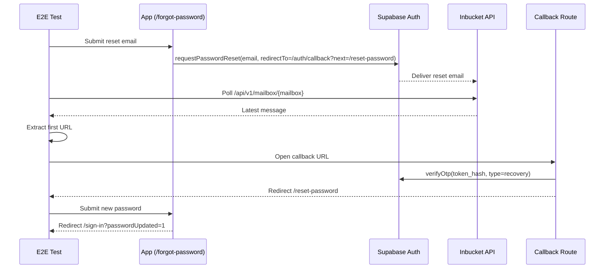

# Testing Architecture

## Purpose and Scope

This document defines how the template verifies the implemented auth and starter dashboard behavior.

Goals:
- Keep `/sign-in` as the canonical auth entry route while preserving `/login` compatibility redirect.
- Validate contracts, services, middleware, server actions, server queries, callback route, and real browser auth flows.
- Keep local and CI runs deterministic with seeded users and Inbucket-based password reset.

Out of scope:
- New product behavior.
- Performance/load testing.
- Visual regression testing.

## Coverage Matrix (Unit vs E2E)

| Layer | File(s) | Covered scenarios |
|---|---|---|
| Contracts DTO | `packages/contracts/src/dto/platform.test.ts` | Auth DTO validation, tenant/user DTO constraints, audit DTO enum + defaults, password confirmation refine path |
| Contracts schemas | `packages/contracts/src/schemas/platform.test.ts` | UUID/entity/auth session schemas, metadata schemas, tenant/audit/action schemas, common field validators |
| Core services | `packages/core/src/services/__tests__/auth-service.test.ts` | Sign-in/out/up/reset/update branches and exact error codes |
| Core env | `packages/core/src/utils/env.test.ts` | Env validation, caching, helpers, predicates, canonical app URL priority + production safety |
| Web redirects | `ui/features/auth/redirects.test.ts` | Safe internal redirect normalization and malformed-input hardening |
| Web middleware | `ui/middleware.test.ts` | Public/protected route behavior, role-home redirects, guest fallback |
| Web actions | `ui/features/auth/actions.test.ts` | All auth actions, validation redirects, success redirects, sign-out integration |
| Web queries | `ui/features/auth/queries.test.ts` | Current user mapping and `requireAuth` redirect |
| Callback route | `ui/app/auth/callback/route.test.ts` | Invalid callback params, OTP error, recovery and non-recovery redirects |
| E2E auth | `ui/e2e/auth/auth.spec.ts` | Sign-in success/failure, deep-link redirect, sign-out, sign-up success/validation failure, forgot-password sent state, protected route redirect, dashboard/settings checks |
| E2E password reset | `ui/e2e/auth/password-reset.spec.ts` | Inbucket polling, reset-link navigation, password update, post-reset login |

## Mocking Strategy

### Supabase mocks
- Use chainable `.from().select().eq().single()` mocks to mirror real query flow.
- Reuse helpers from `ui/test-utils/supabase-mocks.ts` where possible.

### `next/navigation` redirect
- Unit tests mock `redirect()` to throw a sentinel error (`ui/test-utils/redirect.ts`).
- Tests assert redirect destination by checking sentinel digest.

### `server-only`
- Query tests virtual-mock `server-only` to run in Vitest while preserving production module boundary in runtime code.

## Inbucket Password Reset Flow

## Local Execution Pipeline

1. Start local services:
   - `supabase start`
2. Reset deterministic data:
   - `supabase db reset`
3. Run type checks and lint:
   - `pnpm typecheck`
   - `pnpm lint`
4. Run unit tests:
   - `pnpm test`
5. Run browser tests:
   - `pnpm e2e`

## Troubleshooting

- **Cannot sign in with seeded users**
  - Run `supabase db reset` to re-apply `supabase/seed.sql`.
  - Confirm users exist in Auth and `profiles` rows have expected roles.

- **Password reset E2E times out waiting for email**
  - Verify Inbucket is running on `http://localhost:55334`.
  - Optionally set `INBUCKET_URL` when using a non-default local endpoint.
  - Ensure mailbox is not rate-limited; tests rotate between `reset@enterprise.dev` and `reset2@enterprise.dev` on retries.

- **Unexpected redirect behavior in unit tests**
  - Ensure tests use the redirect sentinel helper (`ui/test-utils/redirect.ts`) rather than ad-hoc redirect mocks.

- **Middleware test import fails due env vars**
  - `NEXT_PUBLIC_SUPABASE_URL` and `NEXT_PUBLIC_SUPABASE_ANON_KEY` must be set before importing `ui/middleware.ts` in tests.
